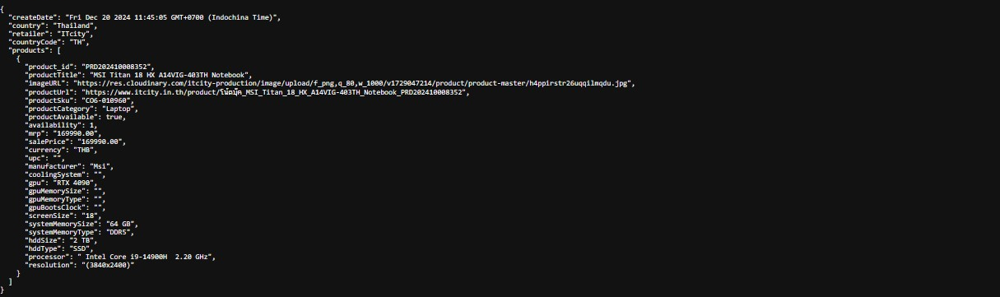

---

## 🧩 Internal API Proxy Transformer

A lightweight internal service that transforms legacy JSON data into a modern structured API, making it easier for partner teams to consume up-to-date data.

---

### 🌐 English Version

**Internal API Proxy Transformer** is a small internal Node.js service I built to address a real-world integration problem. Our organization needed a way to share data with partners without modifying existing legacy systems or building new APIs.

This service:
- Periodically **fetches JSON data** from internal sources using **Cron Jobs**
- **Transforms the structure** to match the format expected by partners (e.g., renaming keys, extracting fields)
- **Exposes the cleaned data** as an internal API on a secure internal server

Thanks to this solution, our partners can access consistent, up-to-date data without any impact on legacy systems.

#### 🔧 Features:
- Internal JSON fetching (no public API)
- Custom transformation logic based on partner needs
- Exposed via internal Express API
- Scheduled with `node-cron`

#### 🛠 Tech Stack:
- Node.js + Express  
- node-cron  
- Axios / HTTP requests  
- Internal server hosting

> *Note: The source code is proprietary and cannot be shared publicly, but I’m happy to discuss the system architecture or implementation strategy.*

---

### 🇹🇭 ภาษาไทย

**Internal API Proxy Transformer** เป็นบริการ Node.js ภายในขนาดเล็ก ที่ผมพัฒนาขึ้นเพื่อแก้ไขปัญหาการส่งต่อข้อมูลจากระบบเดิมไปยังพันธมิตร โดยไม่กระทบกับระบบต้นทาง

ระบบนี้จะ:
- ดึงข้อมูล JSON จาก API ภายในตามเวลาที่กำหนด (โดยใช้ Cron Job)
- แปลงโครงสร้างข้อมูลให้ตรงกับรูปแบบที่พันธมิตรต้องการ เช่น เปลี่ยนชื่อ key หรือแยกค่าจากฟิลด์เดิมออกเป็นฟิลด์ใหม่
- เปิด API ภายในให้สามารถเรียกใช้งานข้อมูลที่แปลงแล้วผ่านเครือข่ายภายในบริษัท

ทำให้พันธมิตรสามารถเข้าถึงข้อมูลที่ถูกต้องและอัปเดตอยู่เสมอ โดยไม่ต้องรบกวนระบบต้นทาง

#### 🔧 สิ่งที่เครื่องมือนี้ทำ:
- ดึงข้อมูล JSON จาก API ภายในที่ไม่มี API สาธารณะ
- แปลงโครงสร้างข้อมูลให้สอดคล้องกับความต้องการของพันธมิตร
- เปิดให้เข้าถึงข้อมูลผ่าน Express API
- ตั้งเวลาเรียกข้อมูลแบบอัตโนมัติด้วย `node-cron`

#### 🛠 เทคโนโลยีที่ใช้:
- Node.js + Express  
- CronJob (node-cron)  
- Axios / HTTP requests  
- โฮสต์อยู่ในเซิร์ฟเวอร์ภายใน

> *หมายเหตุ: ซอร์สโค้ดนี้เป็นกรรมสิทธิ์ของบริษัท ไม่สามารถเปิดเผยต่อสาธารณะได้ แต่สามารถอธิบายแนวทางหรือสถาปัตยกรรมของระบบได้หากสนใจ*

---

